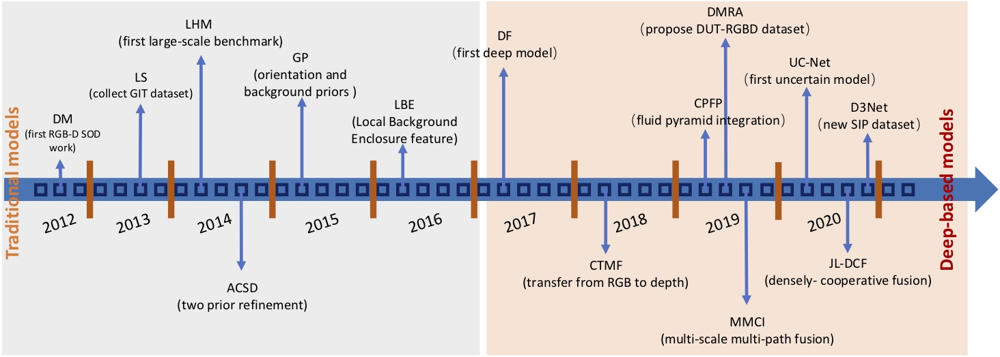
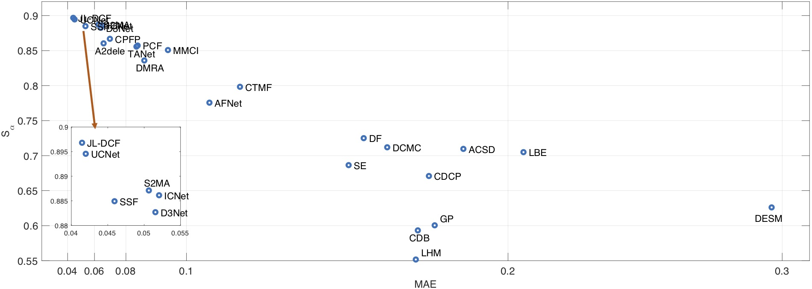
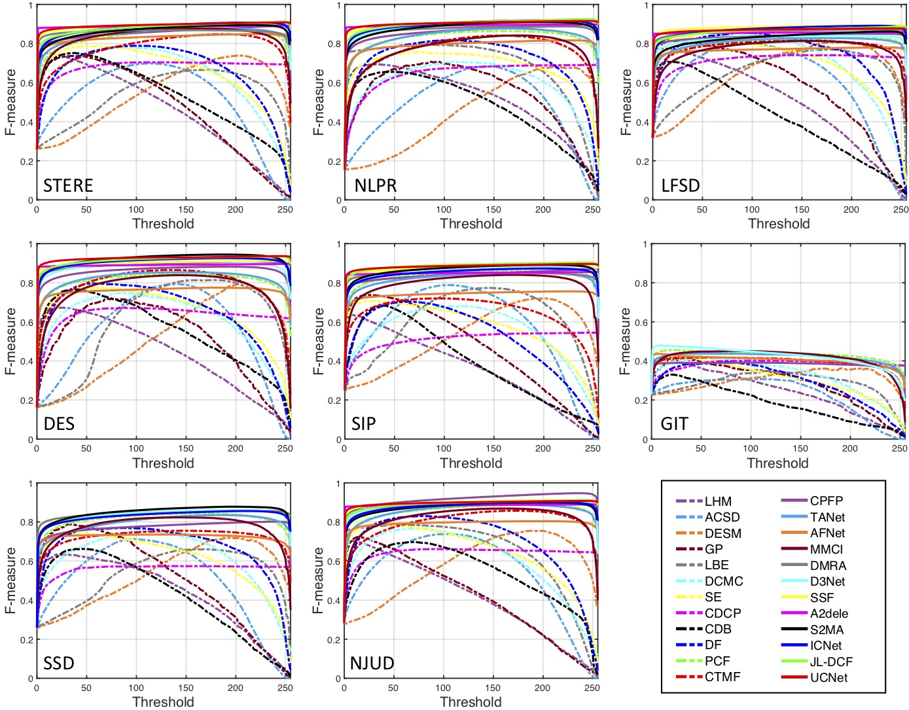

# [RGB-D Salient Object Detection: A Survey](https://arxiv.org/abs/2008.00230) 
Authors: [*Tao Zhou*](https://taozh2017.github.io), [*Deng-Ping Fan*](https://dpfan.net/), [*Ming-Ming Cheng*](https://mmcheng.net/), [*Jianbing Shen*](https://scholar.google.com/citations?user=_Q3NTToAAAAJ&hl=en), [*Ling Shao*](https://scholar.google.com/citations?user=z84rLjoAAAAJ&hl=en).

This is a survey to review related RGB-D SOD models along with benchmark datasets, and provide a comprehensive evaluation for these models. We also collect related review papers for SOD and light field SOD models. If you have papers to recommend or any suggestions, please feel free to contact us.

:running: :running: :running: ***KEEP UPDATING***.   
  
  

*Fig.0: A brief chronology of RGB-D based SOD. The first early RGB-D based SOD work was the [DM](https://link.springer.com/content/pdf/10.1007/978-3-642-33709-3_8.pdf) model, proposed in 2012. Deep learning
techniques have been widely applied to RGB-D based SOD since 2017. More details can be found in our [paper](https://arxiv.org/pdf/2008.00230.pdf).*

------
------

## Content:

1. <a href="#survey"> Related Reviews and Surveys to SOD </a>
2. <a href="#RGBDmodels"> RGB-D SOD Models </a>
3. <a href="#datasets"> RGB-D SOD Datasets </a>
4. <a href="#LFSOD">  Light Field SOD </a>
    1. <a href="#LFmodels">  LF SOD Models </a>
    1. <a href="#LFdatasets">  LF Datasets </a>
5. <a href="#evaluation"> Evaluation </a>
    1. <a href="#overallevaluation">  Overall Evaluation </a>
    1. <a href="#Attribute">  Attribute-based Evaluation </a>
6. <a href="#benchmark"> RGB-D SOD Benchmark </a>       
7. <a href="#citation"> Citation </a>

------
------

## Related Reviews and Surveys to SOD:  <a id="survey" class="anchor" href="#survey" aria-hidden="true"></a>  

**No.** | **Year** | **Pub.** | **Title** | **Links** 
:-: | :-: | :-: | :-  | :-: 
01 | 2015 | IEEE TIP   |  Salient object detection: A benchmark | [Paper](https://arxiv.org/pdf/1501.02741.pdf)/Project
02 | 2018 | IEEE TCSVT |  Review of visual saliency detection with comprehensive information | [Paper](https://arxiv.org/pdf/1803.03391.pdf)/Project
03 | 2018 | ACM TIST   |  A review of co-saliency detection algorithms: Fundamentals, applications, and challenges | [Paper](https://arxiv.org/pdf/1604.07090.pdf)/Project
04 | 2018 | IEEE TSP   |  Advanced deep-learning techniques for salient and category-specific object detection: A survey| [Paper](https://ieeexplore.ieee.org/document/8253582)/Project
05 | 2018 | IJCV       |  Attentive systems: A survey | [Paper](https://link.springer.com/article/10.1007/s11263-017-1042-6)/Project
06 | 2018 | ECCV       |  Salient Objects in Clutter: Bringing Salient Object Detection to the Foreground | [Paper](http://mftp.mmcheng.net/Papers/18ECCV-SOCBenchmark.pdf)/[Project](http://dpfan.net/socbenchmark/)
07 | 2019 | CVM        |  Salient object detection: A survey | [Paper](https://link.springer.com/content/pdf/10.1007/s41095-019-0149-9.pdf)/Project
08 | 2019 | IEEE TNNLS |  Object detection with deep learning: A review | [Paper](https://arxiv.org/pdf/1807.05511.pdf)/Project
09 | 2019 | arXiv      |  Salient Object Detection in the Deep Learning Era: An In-Depth Survey | [Paper](https://arxiv.org/pdf/1904.09146.pdf)/[Project](https://github.com/wenguanwang/SODsurvey) 

------
------

## RGB-D SOD Models:  <a id="RGBDmodels" class="anchor" href="#RGBDmodels" aria-hidden="true"></a>  
:fire::fire::fire:Update (in 2020-08-28)
**No.** | **Year** | **Model** |**Pub.** | **Title** | **Links** 
:-: | :-: | :-: | :-  | :-  | :-: 
:fire: 97 | 2020 |JL-DCF   | arXiv (CVPR extension)   | Siamese Network for RGB-D Salient Object Detection and Beyond | [Paper](https://arxiv.org/pdf/2008.12134.pdf)/[Project](https://github.com/kerenfu/JLDCF)
:fire: 96 | 2020 |MMNet  | ACM MM  | MMNet: Multi-Stage and Multi-Scale Fusion Network for RGB-D Salient Object Detection | Paper/Project
95 | 2020 |DASNet  | ACM MM        | Is depth really necessary for salient object detection? | [Paper](https://arxiv.org/pdf/2006.00269.pdf)/[Project](http://cvteam.net/projects/2020/DASNet/)
94 | 2020 |FRDT    | ACM MM        | Feature Reintegration over Differential Treatment: A Top-down and Adaptive Fusion Network for RGB-D Salient Object Detection | Paper/[Project](https://github.com/jack-admiral/ACM-MM-FRDT)
93 | 2020 | HANet   | Appl. Sci.       | Hybrid‐Attention Network for RGB‐D Salient Object Detection | Paper/Project
92 | 2020 | DQSD   | IEEE TIP        | Depth Quality Aware Salient Object Detection | [Paper](https://arxiv.org/pdf/2008.04159.pdf)/[Project](https://github.com/qdu1995/DQSD)
91 | 2020 | DQAM   | arXiv         | Knowing Depth Quality In Advance: A Depth Quality Assessment Method For RGB-D Salient Object Detection | [Paper](https://arxiv.org/pdf/2008.04157.pdf)/Project
90 | 2020 | SDSFNet| IEEE TIP      | Improved Saliency Detection in RGB-D Images Using Two-phase Depth Estimation and Selective Deep Fusion | [Paper](http://probb268dca.pic5.ysjianzhan.cn/upload/TIP20_FHR.pdf)/Project
89 | 2020 | ERLF   | IEEE TIP      | Data-Level Recombination and Lightweight Fusion Scheme for RGB-D Salient Object Detection | [Paper](http://probb268dca.pic5.ysjianzhan.cn/upload/TIP20_WXH_q02i.pdf)/[Project](https://github.com/XueHaoWang-Beijing/DRLF)
88 | 2020 | MCINet | arXiv         | MCINet: Multi-level Cross-modal Interaction Network for RGB-D Salient Object Detection | [Paper](https://arxiv.org/pdf/2007.14352.pdf)/Project
87 | 2020 | PGAR   | ECCV          | Progressively Guided Alternate Refinement Network for RGB-D Salient Object Detection | [Paper](https://arxiv.org/pdf/2008.07064.pdf)/[Project](https://github.com/ShuhanChen/PGAR_ECCV20)
86 | 2020 | ATSA   | ECCV          | Asymmetric Two-Stream Architecture for Accurate RGB-D Saliency Detection	| [Paper](https://www.ecva.net/papers/eccv_2020/papers_ECCV/papers/123730375.pdf)/[Project](https://github.com/sxfduter/ATSA)
85 | 2020 | BBS-Net| ECCV          | BBS-Net: RGB-D Salient Object Detection with a Bifurcated Backbone Strategy Network | [Paper](https://arxiv.org/pdf/2007.02713.pdf)/[Project](https://github.com/zyjwuyan/BBS-Net)
84 | 2020 | CoNet  | ECCV          | Accurate RGB-D Salient Object Detection via Collaborative Learning | [Paper](https://arxiv.org/pdf/2007.11782.pdf)/[Project](https://github.com/jiwei0921/CoNet)
83 | 2020 | DANet  | ECCV          | A Single Stream Network for Robust and Real-time RGB-D Salient Object Detection | [Paper](https://arxiv.org/pdf/2007.06811.pdf)/[Project](https://github.com/Xiaoqi-Zhao-DLUT/DANet-RGBD-Saliency)
82 | 2020 | CMMS   | ECCV          | RGB-D salient object detection with cross-modality modulation and selection | [Paper](https://arxiv.org/pdf/2007.07051.pdf)/[Project](https://github.com/Li-Chongyi/cmMS-ECCV20)
81 | 2020 | CAS-GNN| ECCV          | Cascade graph neural networks for RGB-D salient object detection | [Paper](https://arxiv.org/pdf/2008.03087.pdf)/[Project](https://github.com/LA30/Cas-Gnn)
80 | 2020 | HDFNet | ECCV          | Hierarchical Dynamic Filtering Network for RGB-D Salient Object Detection | [Paper](https://arxiv.org/pdf/2007.06227.pdf)/[Project](https://github.com/lartpang/HDFNet)
79 | 2020 | CMWNet | ECCV          | Cross-modal weighting network for RGB-D salient object detection | [Paper](https://arxiv.org/pdf/2007.04901.pdf)/[Project](https://github.com/MathLee/CMWNet)
78 | 2020 | UC-Net | CVPR          | UC-Net: Uncertainty Inspired RGB-D Saliency Detection via Conditional Variational Autoencoders | [Paper](https://openaccess.thecvf.com/content_CVPR_2020/papers/Zhang_UC-Net_Uncertainty_Inspired_RGB-D_Saliency_Detection_via_Conditional_Variational_Autoencoders_CVPR_2020_paper.pdf)/[Project](https://github.com/JingZhang617/UCNet)
77 | 2020 | S2MA   | CVPR          | Learning selective self-mutual attention for RGB-D saliency detection | [Paper](https://openaccess.thecvf.com/content_CVPR_2020/papers/Liu_Learning_Selective_Self-Mutual_Attention_for_RGB-D_Saliency_Detection_CVPR_2020_paper.pdf)/[Project](https://github.com/nnizhang/S2MA)
76 | 2020 | SSF    | CVPR          | Select, supplement and focus for RGB-D saliency detection | [Paper](https://openaccess.thecvf.com/content_CVPR_2020/papers/Zhang_Select_Supplement_and_Focus_for_RGB-D_Saliency_Detection_CVPR_2020_paper.pdf)/[Project](https://github.com/OIPLab-DUT/CVPR_SSF-RGBD)
75 | 2020 | A2dele | CVPR          | A2dele: Adaptive and Attentive Depth Distiller for Efficient RGB-D Salient Object Detection | [Paper](https://openaccess.thecvf.com/content_CVPR_2020/papers/Piao_A2dele_Adaptive_and_Attentive_Depth_Distiller_for_Efficient_RGB-D_Salient_CVPR_2020_paper.pdf)/[Project](https://github.com/OIPLab-DUT/CVPR2020-A2dele)
74 | 2020 | JL-DCF | CVPR          | JL-DCF: Joint learning and densely-cooperative fusion framework for RGB-D salient object detection | [Paper](https://openaccess.thecvf.com/content_CVPR_2020/papers/Fu_JL-DCF_Joint_Learning_and_Densely-Cooperative_Fusion_Framework_for_RGB-D_Salient_CVPR_2020_paper.pdf)/[Project](https://github.com/kerenfu/JLDCF)
73 | 2020 | D3Net  |IEEE TNNLS     | Rethinking RGB-D salient object detection: models, datasets, and large-scale benchmarks | [Paper](https://arxiv.org/pdf/1907.06781.pdf)/[Project](https://github.com/DengPingFan/D3NetBenchmark)
72 | 2020 | RGBS   |MTAP           | Salient object detection for RGB-D images by generative adversarial network | [Paper](https://link.springer.com/article/10.1007/s11042-020-09188-8)/Project
71 | 2020 | GFNe   |IEEE SPL       | GFNet: Gate fusion network with res2net for detecting salient objects in RGB-D images | [Paper](https://ieeexplore.ieee.org/document/9090350)/Project
70 | 2020 | SDF   | IEEE TIP       | Improved saliency detection in RGB-D images using two-phase depth estimation and selective deep fusion | [Paper](https://ieeexplore.ieee.org/document/8976428)/Project
69 | 2020 | ICNet | IEEE TIP       | ICNet: Information Conversion Network for RGB-D Based Salient Object Detection| [Paper](https://ieeexplore.ieee.org/document/9024241)/[Project](https://github.com/MathLee/ICNet-for-RGBD-SOD)
68 | 2020 |Triple-Net | IEEE SPL   | Triple-complementary network for RGB-D salient object detection| [Paper](https://ieeexplore.ieee.org/document/9076277)/Project
67 | 2020 |ASIF-Net | IEEE TCYB    | ASIF-Net: Attention steered interweave fusion network for RGB-D salient object detection| [Paper](https://ieeexplore.ieee.org/document/8998588)/[Project](https://github.com/Li-Chongyi/ASIF-Net)
66 | 2020 |BiANet | IEEE TIP       | Bilateral Attention Network for RGB-D Salient Object Detection | [Paper](https://arxiv.org/pdf/2004.14582.pdf)/Project
65 | 2020 |PGHF   | IEEE Access    | Multi-modal weights sharing and hierarchical feature fusion for rgbd salient object detection | [Paper](https://ieeexplore.ieee.org/stamp/stamp.jsp?tp=&arnumber=8981965)/Project
64 | 2020 |cmSalGAN | IEEE TMM     | cmSalGAN: RGB-D Salient Object Detection with Cross-View Generative Adversarial Networks | [Paper](https://arxiv.org/pdf/1912.10280.pdf)/Project
63 | 2020 | CoCNN | PR             | CoCNN: RGB-D deep fusion for stereoscopic salient object detection | [Paper](https://www.sciencedirect.com/science/article/abs/pii/S0031320320301321)/Project
62 | 2020 | GFNet | Neurocomputing | A cross-modal adaptive gated fusion generative adversarial network for RGB-D salient object detection | [Paper](https://www.sciencedirect.com/science/article/abs/pii/S0925231220300904)/Project
61 | 2020 | AttNet| IVC            | Attention-guided RGBD saliency detection using appearance information | [Paper](https://www.sciencedirect.com/science/article/abs/pii/S0262885620300202)/Project
60 | 2020 | SSDF   |arXiv          | Synergistic saliency and depth prediction for RGB-D saliency detection | [Paper](https://arxiv.org/pdf/2007.01711.pdf)/Project
59 | 2020 |DPANet | arXiv          | DPANet: Depth Potentiality-Aware Gated Attention Network for RGB-D Salient Object Detection | [Paper](https://arxiv.org/pdf/2003.08608.pdf)/Project
58 | 2019 | DSD   | JVCIR          | Depth-aware saliency detection using convolutional neural networks | [Paper](https://www.sciencedirect.com/science/article/pii/S104732031930118X)/Project
57 | 2019 | DMRA  | ICCV           | Depth-induced Multi-scale Recurrent Attention Network for Saliency Detection | [Paper](https://openaccess.thecvf.com/content_ICCV_2019/papers/Piao_Depth-Induced_Multi-Scale_Recurrent_Attention_Network_for_Saliency_Detection_ICCV_2019_paper.pdf)/[Project](https://github.com/jiwei0921/DMRA)
56 | 2019 | CPFP  | CVPR           | Contrast Prior and Fluid Pyramid Integration for RGBD Salient Object Detection | [Paper](https://openaccess.thecvf.com/content_CVPR_2019/papers/Zhao_Contrast_Prior_and_Fluid_Pyramid_Integration_for_RGBD_Salient_Object_CVPR_2019_paper.pdf)/[Project](https://github.com/JXingZhao/ContrastPrior)
55 | 2019 | EPM   | IEEE Access    | Co-saliency detection for rgbd images based on effective propagation mechanism | [Paper](https://ieeexplore.ieee.org/document/8849990)/Project
54 | 2019 | AFNet | IEEE Access    | Adaptive Fusion for RGB-D Salient Object Detection | [Paper](https://arxiv.org/pdf/1901.01369.pdf)/[Project](https://github.com/Lucia-Ningning/Adaptive_Fusion_RGBD_Saliency_Detection)
53 | 2019 | LSF   | arXiv          | CNN-based RGB-D Salient Object Detection: Learn, Select and Fuse | [Paper](https://arxiv.org/pdf/1909.09309.pdf)/Project
52 | 2019 | DGT   | IEEE TCYB      | Going from RGB to RGBD saliency: A depth-guided transformation model | [Paper](https://www.researchgate.net/publication/335360400_Going_From_RGB_to_RGBD_Saliency_A_Depth-Guided_Transformation_Model)/[Project](https://rmcong.github.io/proj_RGBD_sal_DTM_tcyb.html)
51 | 2019 | DCMF  | IEEE TCYB      | Discriminative cross-modal transfer learning and densely cross-level feedback fusion for RGB-D salient object detection | [Paper](https://ieeexplore.ieee.org/document/8820129)/Project
50 | 2019 | TANet | IEEE TIP       | Three-stream attention-aware network for RGB-D salient object detection | [Paper](https://ieeexplore.ieee.org/document/8603756)/Project
49 | 2019 | DCA   | IEEE TIP       | Saliency detection via depth-induced cellular automata on light field| [Paper](https://ieeexplore.ieee.org/document/8866752)/Project
48 | 2019 | MMCI  | PR             | Multi-modal fusion network with multi-scale multi-path and cross-modal interactions| [Paper](https://www.sciencedirect.com/science/article/abs/pii/S0031320318303054)/Project
47 | 2019 | PDNet | ICME           | Prior-model guided depth-enhanced network for salient object detection| [Paper](https://arxiv.org/pdf/1803.08636.pdf)/[Project](https://github.com/cai199626/PDNet)
46 | 2019 | CAFM  | IEEE TSMC      | Global and Local-Contrast Guides Content-Aware Fusion for RGB-D Saliency Prediction | [Paper](https://ieeexplore.ieee.org/document/8941002)/Project
45 | 2019 | DIL   | MTAP           | Salient object segmentation based on depth-aware image layering | [Paper](https://link.springer.com/article/10.1007/s11042-018-6736-4)/Project
44 | 2019 | TSRN  | ICIP           | Two-stream refinement network for RGB-D saliency detection | [Paper](https://ieeexplore.ieee.org/document/8803653)/Project
43 | 2019 | MLF   | SPL            | RGB-D salient object detection by a CNN with multiple layers fusion | [Paper](https://ieeexplore.ieee.org/document/8638984)/Project
42 | 2019 | SSRC  | Neurocomputing | Salient object detection for RGB-D image by single stream recurrent convolution neural network | [Paper](https://www.sciencedirect.com/science/article/abs/pii/S0925231219309403)/Project
41 | 2018 | CDB   | Neurocomputing | Stereoscopic saliency model using contrast and depth-guided-background prior | [Paper](https://www.sciencedirect.com/science/article/abs/pii/S0925231217317034)/Project
40 | 2018 | ACCF  | IROS           | Attention-Aware Cross-Modal Cross-Level Fusion Network for RGB-D Salient Object Detection | [Paper](https://ieeexplore.ieee.org/document/8594373)/Project
39 | 2018 | SCDL  | ICDSP          | Rgbd salient object detection using spatially coherent deep learning framework | [Paper](https://ieeexplore.ieee.org/document/8631584)/Project
38 | 2018 | PCF   | CVPR           | Progressively complementarityaware fusion network for RGB-D salient object detection | [Paper](https://openaccess.thecvf.com/content_cvpr_2018/papers/Chen_Progressively_Complementarity-Aware_Fusion_CVPR_2018_paper.pdf)/[Project](https://github.com/haochen593/PCA-Fuse_RGBD_CVPR18)
37 | 2018 | CTMF  | IEEE TCYB      | CNNs-based RGB-D saliency detection via cross-view transfer and multiview fusion | [Paper](https://ieeexplore.ieee.org/document/8091125)/[Project](https://github.com/haochen593/CTMF)
36 | 2018 | ICS   | IEEE TIP       | Co-saliency detection for RGBD images based on multi-constraint feature matching and cross label propagation | [Paper](https://arxiv.org/pdf/1710.05172.pdf)/Project
35 | 2018 | HSCS  | IEEE TMM       | HSCS: Hierarchical sparsity based co-saliencydetection for RGBD images | [Paper](https://arxiv.org/pdf/1811.06679.pdf)/[Project](https://github.com/rmcong/Results-for-2018TMM-HSCS)
34 | 2017 | ISC   | SIVP           | An integration of bottom-up and top-down salient cueson rgb-d data: saliency from objectness versus non-objectness | [Paper](https://arxiv.org/pdf/1807.01532.pdf)/Project
33 | 2017 | MCLP  | IEEE TCYB      | An iterative co-saliency framework for RGBD images | [Paper](https://arxiv.org/pdf/1711.01371.pdf)/Project
32 | 2017 | DF    | IEEE TIP       | RGBD Salient Object Detection via Deep Fusion | [Paper](https://arxiv.org/pdf/1607.03333.pdf)/[Project](https://pan.baidu.com/s/1Y-PqAjuH9xREBjfl7H45HA)
31 | 2017 | MDSF  | IEEE TIP       | Depth-Aware Salient Object Detection and Segmentation via Multiscale Discriminative Saliency Fusion and Bootstrap Learning | [Paper](https://ieeexplore.ieee.org/document/7938352)/[Project](https://github.com/ivpshu/Depth-aware-salient-object-detection-and-segmentation-via-multiscale-discriminative-saliency-fusion-)
30 | 2017 | MFF   | IEEE SPL       | RGB-D saliency object detection via minimum barrier distance transformand saliency fusion | [Paper](https://wanganzhi.github.io/papers/SPL17.pdf)/Project
29 | 2017 | TPF   | ICCVW          | A Three-Pathway Psychobiological Framework of Salient Object Detection Using Stereoscopic Technology | [Paper](https://ieeexplore.ieee.org/document/8265566)/Project
28 | 2017 | CDCP  | ICCVW          | An innovative salient object detection using center-dark channel prior | [Paper](https://openaccess.thecvf.com/content_ICCV_2017_workshops/papers/w22/Zhu_An_Innovative_Salient_ICCV_2017_paper.pdf)/[Project](https://github.com/ChunbiaoZhu/ACVR2017)
27 | 2017 | BED   | ICCVW          | Learning RGB-D Salient Object Detection using background enclosure, depth contrast, and top-down features | [Paper](https://openaccess.thecvf.com/content_ICCV_2017_workshops/papers/w40/Shigematsu_Learning_RGB-D_Salient_ICCV_2017_paper.pdf)/[Project](https://github.com/sshige/rgbd-saliency)
26 | 2017 | MFLN  | ICCVS          | RGB-D Saliency Detection by Multi-stream Late Fusion Network | [Paper](https://link.springer.com/chapter/10.1007/978-3-319-68345-4_41)/Project
25 | 2017 | M3Net | IROS           | M3Net: Multi-scale multi-path multi-modal fusion network and example application to RGB-D salient object detection | [Paper](https://ieeexplore.ieee.org/abstract/document/8206370)/Project
24 | 2017 | HOSO  | DICTA          | HOSO: Histogram of Surface Orientation for RGB-D Salient Object Detection | [Paper](https://ieeexplore.ieee.org/document/8227440)/Project
23 | 2016 | GM    | ACCV           | Visual Saliency detection for RGB-D images with generative mode | [Paper](https://link.springer.com/chapter/10.1007/978-3-319-54193-8_2)/Project
22 | 2016 | DSF   | ICASSP         | Depth-aware saliency detection using discriminative saliency fusion | [Paper](https://ieeexplore.ieee.org/document/7471952)/Project
21 | 2016 | DCI   | ICASSP         | Saliency analysis based on depth contrast increased | [Paper](http://sites.nlsde.buaa.edu.cn/~shenghao/Download/publications/2016/9.Saliency%20analysis%20based%20on%20depth%20contrast%20increased.pdf)/Project
20 | 2016 | BF    | ICPR           | RGB-D saliency detection under Bayesian framework | [Paper](https://ieeexplore.ieee.org/document/7899911)/Project
19 | 2016 | DCMC  | IEEE SPL       | Saliency detection for stereoscopic images based on depth confidence analysis and multiple cues fusion  | [Paper](https://ieeexplore.ieee.org/document/7457641)/[Project](https://github.com/rmcong/Code-for-DCMC-method)
18 | 2016 | SE    | ICME           | Salient object detection for RGB-D image via saliency evolution | [Paper](https://ieeexplore.ieee.org/document/7552907)/Project
17 | 2016 | LBE   | CVPR           | Local Background Enclosure for RGB-D Salient Object Detection| [Paper](https://www.cv-foundation.org/openaccess/content_cvpr_2016/app/S10-09.pdf)/[Project](http://users.cecs.anu.edu.au/~u4673113/lbe.html)
16 | 2016 | PRC   | IEEE Access    | Improving RGBD Saliency Detection Using Progressive Region Classification and Saliency Fusion| [Paper](https://ieeexplore.ieee.org/stamp/stamp.jsp?tp=&arnumber=7762806)/Project
15 | 2015 | SF    | CAC            | Selective features for RGB-D saliency | [Paper](https://ieeexplore.ieee.org/document/7382554)/Project
14 | 2015 | MGMR  | ICIP           | RGB-D saliency detection via mutual guided manifold ranking | [Paper](https://ieeexplore.ieee.org/document/7350882)/Project
13 | 2015 | SRD   | ICRA           | Salient Regions Detection for Indoor Robots using RGB-D Data | [Paper](http://www.cogsys.cs.uni-tuebingen.de/publikationen/2015/Jiang_ICRA15.pdf)/Project
12 | 2015 | DIC   | TVC            | Depth incorporating with color improves salient object detection | [Paper](https://link.springer.com/article/10.1007/s00371-014-1059-6)/Project
11 | 2015 | SFP   | ICIMCS         | Salient object detection in RGB-D image based on saliency fusion and propagation | [Paper](https://dl.acm.org/doi/10.1145/2808492.2808551)/Project
10 | 2015 | GP    | CVPRW          | Exploiting global priors for RGB-D saliency detection | [Paper](https://www.cv-foundation.org/openaccess/content_cvpr_workshops_2015/W14/papers/Ren_Exploiting_Global_Priors_2015_CVPR_paper.pdf)/[Project](https://github.com/JianqiangRen/Global_Priors_RGBD_Saliency_Detection)
09 | 2014 | ACSD  | ICIP           | Depth saliency based on anisotropic center-surround difference | [Paper](https://projet.liris.cnrs.fr/imagine/pub/proceedings/ICIP-2014/Papers/1569913831.pdf)/[Project](https://github.com/HzFu/DES_code)
08 | 2014 | DESM  | ICIMCS         | Depth Enhanced Saliency Detection Method | [Paper](http://dpfan.net/wp-content/uploads/DES_dataset_ICIMCS14.pdf)/Project
07 | 2014 | LHM   | ECCV           | RGBD Salient Object Detection: A Benchmark and Algorithms | [Paper](http://dpfan.net/wp-content/uploads/NLPR_dataset_ECCV14.pdf)/[Project](https://sites.google.com/site/rgbdsaliency/code)
06 | 2014 | SRDS  | ICDSP          | Salient region detection for stereoscopic images | [Paper](https://ieeexplore.ieee.org/stamp/stamp.jsp?tp=&arnumber=6900706)/Project 
05 | 2013 | SOS   | Neurocomputing | Depth really Matters: Improving Visual Salient Region Detection with Depth | [Paper](https://www.sciencedirect.com/science/article/abs/pii/S0925231213002981)/Project 
04 | 2013 | RC    | BMVC           | Depth really Matters: Improving Visual Salient Region Detection with Depth | [Paper](http://cdn.iiit.ac.in/cdn/cvit.iiit.ac.in/images/ConferencePapers/2013/cv_deepth-really.pdf)/Project 
03 | 2013 | LS    | BMVC           | An In Depth View of Saliency                                     | [Paper](http://www.cs.utah.edu/~thermans/papers/ciptadi-bmvc2013.pdf)/Project 
02 | 2012 | RCM   | ICCSE          | Depth combined saliency detection based on region contrast model | [Paper](https://ieeexplore.ieee.org/document/6295184)/Project 
01 | 2012 | DM    | ECCV           | Depth matters: Influence of depth cues on visual saliency        | [Paper](https://link.springer.com/content/pdf/10.1007/978-3-642-33709-3_8.pdf)/Project 

------
------

## RGB-D SOD Datasets:  <a id="datasets" class="anchor" href="#datasets" aria-hidden="true"></a>  

**No.** |**Dataset** | **Year** | **Pub.** |**Size** | **#Obj.** | **Types** | **Resolution** | **Download**
:-: | :-: | :-: | :-  | :-  | :-:| :-: | :-: | :-:
1   | [**STERE**](http://dpfan.net/wp-content/uploads/STERE_dataset_CVPR12.pdf)   |2012 |CVPR   | 1000 | ~One       |Internet             | [251-1200] * [222-900] | [link](http://dpfan.net/d3netbenchmark/)
2   | [**GIT**](http://www.bmva.org/bmvc/2013/Papers/paper0112/abstract0112.pdf)  |2013 |BMVC   | 80   | Multiple  |Home environment     | 640 * 480 | [link](http://dpfan.net/d3netbenchmark/)
3   | [**DES**](http://dpfan.net/wp-content/uploads/DES_dataset_ICIMCS14.pdf)     |2014 |ICIMCS | 135  | One       |Indoor               | 640 * 480 | [link](http://dpfan.net/d3netbenchmark/)
4   | [**NLPR**](http://dpfan.net/wp-content/uploads/NLPR_dataset_ECCV14.pdf)     |2014 |ECCV   | 1000 | Multiple  |Indoor/outdoor       | 640 * 480, 480 * 640 | [link](http://dpfan.net/d3netbenchmark/)
5   | [**LFSD**](http://dpfan.net/wp-content/uploads/LFSD_dataset_CVPR14.pdf)     |2014 |CVPR   | 100  | One       |Indoor/outdoor       | 360 * 360 | [link](http://dpfan.net/d3netbenchmark/)
6   | [**NJUD**](http://dpfan.net/wp-content/uploads/NJU2K_dataset_ICIP14.pdf)     |2014 |ICIP   | 1985 | ~One       |Moive/internet/photo | [231-1213] * [274-828] | [link](http://dpfan.net/d3netbenchmark/)
7   | [**SSD**](http://dpfan.net/wp-content/uploads/SSD_dataset_ICCVW17.pdf)      |2017 |ICCVW  | 80   | Multiple  |Movies               | 960 *1080  | [link](http://dpfan.net/d3netbenchmark/)
8   | [**DUT-RGBD**](https://openaccess.thecvf.com/content_ICCV_2019/papers/Piao_Depth-Induced_Multi-Scale_Recurrent_Attention_Network_for_Saliency_Detection_ICCV_2019_paper.pdf) |2019 |ICCV   | 1200 | Multiple  |Indoor/outdoor       | 400 * 600 | [link](http://dpfan.net/d3netbenchmark/)
9   | [**SIP**](http://dpfan.net/wp-content/uploads/SIP_dataset_TNNLS20.pdf)     |2020 |TNNLS  | 929  | Multiple  |Person in wild       | 992 * 774 | [link](http://dpfan.net/d3netbenchmark/)

------
------
## Light Field SOD:  <a id="LFSOD" class="anchor" href="#LFSOD" aria-hidden="true"></a>  

### LF SOD Models: <a id="LFmodels" class="anchor" href="#LFmodels" aria-hidden="true"></a> 

**No.** | **Year** | **Model** |**Pub.** | **Title** | **Links** 
:-: | :-: | :-: | :-  | :-  | :-: 
01 | 2014 | LFS   | CVPR   | Saliency detection on light field | [Paper](https://sites.duke.edu/nianyi/files/2020/06/Li_Saliency_Detection_on_2014_CVPR_paper.pdf)/[Project](https://sites.duke.edu/nianyi/publication/saliency-detection-on-light-field/)
02 | 2015 | WSC   | CVPR   | A weighted sparse coding framework for saliency detection | [Paper](https://openaccess.thecvf.com/content_cvpr_2015/papers/Li_A_Weighted_Sparse_2015_CVPR_paper.pdf)/[Project](https://www.researchgate.net/publication/294874666_Code_WSC)
03 | 2015 | DILF  | IJCAI  | Saliency detection with a deeper investigationof light field | [Paper](https://www.ijcai.org/Proceedings/15/Papers/313.pdf)/[Project](https://github.com/pencilzhang/lightfieldsaliency_ijcai15)
04 | 2016 | RL    | ICASSP | Relative location for light field saliency detection | [Paper](http://sites.nlsde.buaa.edu.cn/~shenghao/Download/publications/2016/11.Relative%20location%20for%20light%20field%20saliency%20detection.pdf)/Project
05 | 2017 | MA    | ACM TOMM   | Saliency detection on light field: A multi-cue approach | [Paper](http://www.linliang.net/wp-content/uploads/2017/07/ACMTOM_Saliency.pdf)/Project
06 | 2017 | BIF   | NPL    | A two-stage bayesian integration framework for salient object detection on light field | [Paper](https://link.springer.com/article/10.1007/s11063-017-9610-x)/Project
07 | 2017 | LFS   | IEEE TPAMI  | Saliency Detection on Light Field | [Paper](https://ieeexplore.ieee.org/document/7570181)/[Project](https://sites.duke.edu/nianyi/publication/saliency-detection-on-light-field/)
08 | 2017 | RLM   | ICIVC  | Saliency detection with relative location measure in light field image | [Paper](https://ieeexplore.ieee.org/document/7984449/)/Project
09 | 2017 | SGDC  | CVPR   | Salience guided depth calibration for perceptually optimized compressive light field 3D display | [Paper](https://ieeexplore.ieee.org/document/8578315/)/Project
10 | 2018 | DCA   | FiO    | Depth-induced cellular automata for light field saliency | [Paper](https://ieeexplore.ieee.org/document/8866752)/Project
11 | 2019 | DLLF  | ICCV   | Deep learning for light field saliency detection | [Paper](https://openaccess.thecvf.com/content_ICCV_2019/papers/Wang_Deep_Learning_for_Light_Field_Saliency_Detection_ICCV_2019_paper.pdf)/[Project](https://github.com/OIPLab-DUT/ICCV2019_Deeplightfield_Saliency)
12 | 2019 | DLSD  | IJCAI  | Deep light-field-driven saliency detection from a single view | [Paper](https://www.ijcai.org/Proceedings/2019/0127.pdf)/Project
13 | 2019 | Molf  | NIPS   | Memory-oriented decoder for light field salient object detection | [Paper](https://papers.nips.cc/paper/8376-memory-oriented-decoder-for-light-field-salient-object-detection.pdf)/[Project](https://github.com/OIPLab-DUT/MoLF)
14 | 2020 | ERNet | AAAI   | Exploit and replace: An asymmetrical two-stream architecture for versatile light field saliency detection | [Paper](https://www.aiide.org/ojs/index.php/AAAI/article/view/6860)/Project
15 | 2020 | DCA   | IEEE TIP    | Saliency detection via depth-induced cellular automata onlight field | [Paper](https://ieeexplore.ieee.org/document/8866752)/Project
16 | 2020 | RDFD  | MTAP   | Region-based depth feature descriptor for saliency detection light field | [Paper](https://link.springer.com/article/10.1007%2Fs11042-020-08890-x)/Project
17 | 2020 | LFNet | IEEE TIP    | LFNet light field fusion network for salient object detection | [Paper](https://ieeexplore.ieee.org/document/9082882)/[Project](https://github.com/jiwei0921/LFNet)
18 | 2020 | LFDCN | IEEE TIP    | Light field saliency detection with deep convolutional networks | [Paper](https://arxiv.org/pdf/1906.08331.pdf)/[Project](https://github.com/pencilzhang/MAC-light-field-saliency-net)

### LF Datasets: <a id="LFdatasets" class="anchor" href="#LFdatasets" aria-hidden="true"></a> 

**No.** |**Dataset** | **Year** | **Pub.** |**Size** | **Description** | **Download**
:-: | :-: | :-: | :-  | :-  | :-:| :-: 
1   | [**LFSD**](https://sites.duke.edu/nianyi/files/2020/06/Li_Saliency_Detection_on_2014_CVPR_paper.pdf)   |2014 |CVPR   | 100  | It contains 60 indoor and 40 outdoor scenes, and most scenes consist of only one salient object | [link](https://sites.duke.edu/nianyi/publication/saliency-detection-on-light-field/)
2   | [**HFUT**](http://www.linliang.net/wp-content/uploads/2017/07/ACMTOM_Saliency.pdf)                 |2017 |ACM TOMM   | 255  | Most scenes contain multipleobjects that appear within different locations and scales under complex background clutter | [link](https://github.com/pencilzhang/HFUT-Lytro-dataset)
3   | [**HFUT**](http://www.linliang.net/wp-content/uploads/2017/07/ACMTOM_Saliency.pdf)                 |2017 |ACM TOMM   | 255  | Most scenes contain multipleobjects that appear within different locations and scales under complex background clutter | [link](https://github.com/pencilzhang/HFUT-Lytro-dataset)
4   | [**DUTLF-FS**](https://openaccess.thecvf.com/content_ICCV_2019/papers/Wang_Deep_Learning_for_Light_Field_Saliency_Detection_ICCV_2019_paper.pdf)             |2019 |ICCV       | 1465 | It contains several challenges, including lower contrast between salient objects and cluttered background, multiple disconnected salient objects, and dark or strong light conditions | [link](https://github.com/OIPLab-DUT/ICCV2019_Deeplightfield_Saliency)
5   | [**DUTLF-MV**](https://www.ijcai.org/Proceedings/2019/0127.pdf)                                    |2019 |IJCAI      | 1580 | Each light field consists of multi-view images and a corresponding ground truth | [link](https://github.com/TuesdayT/IJCAI2019-Deep-Light-Field-Driven-Saliency-Detection-from-A-Single-View)
6   | [**Lytro Illum**](https://arxiv.org/pdf/1906.08331.pdf)                                            |2020 |IEEE TIP   | 640  | It includes several challenging factors, e.g., inconsistent illumi?nation conditions, and small salient objects existing in a similar or cluttered background | [link](https://github.com/pencilzhang/MAC-light-field-saliency-net)

------
------

## Evaluation:  <a id="evaluation" class="anchor" href="#evaluation" aria-hidden="true"></a>  

### Overall Evaluation: <a id="overallevaluation" class="anchor" href="#overallevaluation" aria-hidden="true"></a> 

*Fig.1: A comprehensive evaluation for 24 representative RGB-D based SOD models, including [LHM](http://dpfan.net/wp-content/uploads/NLPR_dataset_ECCV14.pdf), [ACSD](http://dpfan.net/wp-content/uploads/DES_dataset_ICIMCS14.pdf), [DESM](http://dpfan.net/wp-content/uploads/DES_dataset_ICIMCS14.pdf), 
[GP](https://www.cv-foundation.org/openaccess/content_cvpr_workshops_2015/W14/papers/Ren_Exploiting_Global_Priors_2015_CVPR_paper.pdf),
[LBE](https://www.cv-foundation.org/openaccess/content_cvpr_2016/app/S10-09.pdf), 
[DCMC](https://ieeexplore.ieee.org/document/7457641), 
[SE](https://ieeexplore.ieee.org/document/7552907), 
[CDCP](https://openaccess.thecvf.com/content_ICCV_2017_workshops/papers/w22/Zhu_An_Innovative_Salient_ICCV_2017_paper.pdf), 
[CDB](https://www.sciencedirect.com/science/article/abs/pii/S0925231217317034), 
[DF](https://arxiv.org/pdf/1607.03333.pdf), 
[PCF](https://openaccess.thecvf.com/content_cvpr_2018/papers/Chen_Progressively_Complementarity-Aware_Fusion_CVPR_2018_paper.pdf), 
[CTMF](https://ieeexplore.ieee.org/document/8091125), 
[CPFP](https://openaccess.thecvf.com/content_CVPR_2019/papers/Zhao_Contrast_Prior_and_Fluid_Pyramid_Integration_for_RGBD_Salient_Object_CVPR_2019_paper.pdf), 
[TANet](https://ieeexplore.ieee.org/document/8603756), 
[AFNet](https://arxiv.org/pdf/1901.01369.pdf), 
[MMCI](https://www.sciencedirect.com/science/article/abs/pii/S0031320318303054), 
[DMRA](https://openaccess.thecvf.com/content_ICCV_2019/papers/Piao_Depth-Induced_Multi-Scale_Recurrent_Attention_Network_for_Saliency_Detection_ICCV_2019_paper.pdf), 
[D3Net](https://arxiv.org/pdf/1907.06781.pdf), 
[SSF](https://openaccess.thecvf.com/content_CVPR_2020/papers/Zhang_Select_Supplement_and_Focus_for_RGB-D_Saliency_Detection_CVPR_2020_paper.pdf), 
[A2dele](https://openaccess.thecvf.com/content_CVPR_2020/papers/Piao_A2dele_Adaptive_and_Attentive_Depth_Distiller_for_Efficient_RGB-D_Salient_CVPR_2020_paper.pdf), 
[S2MA](https://openaccess.thecvf.com/content_CVPR_2020/papers/Liu_Learning_Selective_Self-Mutual_Attention_for_RGB-D_Saliency_Detection_CVPR_2020_paper.pdf), 
[ICNet](https://ieeexplore.ieee.org/document/9024241), 
[JL-DCF](https://openaccess.thecvf.com/content_CVPR_2020/papers/Fu_JL-DCF_Joint_Learning_and_Densely-Cooperative_Fusion_Framework_for_RGB-D_Salient_CVPR_2020_paper.pdf), and 
[UC-Net](https://openaccess.thecvf.com/content_CVPR_2020/papers/Zhang_UC-Net_Uncertainty_Inspired_RGB-D_Saliency_Detection_via_Conditional_Variational_Autoencoders_CVPR_2020_paper.pdf). 
We obtain the terms of $S_{\alpha}$ and MAE values for the 24 models on five datasets (i.e., [STERE](http://dpfan.net/wp-content/uploads/STERE_dataset_CVPR12.pdf), 
[NLPR](http://dpfan.net/wp-content/uploads/NLPR_dataset_ECCV14.pdf), 
[LFSD](http://dpfan.net/wp-content/uploads/LFSD_dataset_CVPR14.pdf), 
[DES](http://dpfan.net/wp-content/uploads/DES_dataset_ICIMCS14.pdf), and [SIP](http://dpfan.net/wp-content/uploads/SIP_dataset_TNNLS20.pdf)
). We report the mean values of $S_{\alpha}$ and MAE across the five datasets. Note that these better models are shown in the upper left corner (\ie, with a larger $S_{\alpha}$ and smaller MAE).*

======================= **run evaluation code** ===============================

1. We have computed values of different evaluation metrics for each image of each models and save as '***.mat', and the results can be downloaded from Google Drive or [Baidu Drive](https://pan.baidu.com/s/1kGRoErBvEzYY3t4pRxUSrA)(extraction code: urra).
2. Please unzip the downloaded file 'Sal_Det_Results_24_Models.zip' and put it into the file 'results';
3. To run 'run_overall_evaluation.m' (plot Fig.1 )

======================================================================

*Fig.2: PR curves for 24 RGB-D based models on [STERE](http://dpfan.net/wp-content/uploads/STERE_dataset_CVPR12.pdf),
[NLPR](http://dpfan.net/wp-content/uploads/NLPR_dataset_ECCV14.pdf), 
[LFSD](http://dpfan.net/wp-content/uploads/LFSD_dataset_CVPR14.pdf), 
[DES](http://dpfan.net/wp-content/uploads/DES_dataset_ICIMCS14.pdf), 
[SIP](http://dpfan.net/wp-content/uploads/SIP_dataset_TNNLS20.pdf), 
[GIT](http://www.bmva.org/bmvc/2013/Papers/paper0112/abstract0112.pdf), 
[SSD](http://dpfan.net/wp-content/uploads/SSD_dataset_ICCVW17.pdf), and 
[NJUD](http://dpfan.net/wp-content/uploads/NJU2K_dataset_ICIP14.pdf) datasets.*

*Fig.3:  F-measures under different thresholds for 24 RGB-D based models on [STERE](http://dpfan.net/wp-content/uploads/STERE_dataset_CVPR12.pdf),
[NLPR](http://dpfan.net/wp-content/uploads/NLPR_dataset_ECCV14.pdf), 
[LFSD](http://dpfan.net/wp-content/uploads/LFSD_dataset_CVPR14.pdf), 
[DES](http://dpfan.net/wp-content/uploads/DES_dataset_ICIMCS14.pdf), 
[SIP](http://dpfan.net/wp-content/uploads/SIP_dataset_TNNLS20.pdf), 
[GIT](http://www.bmva.org/bmvc/2013/Papers/paper0112/abstract0112.pdf), 
[SSD](http://dpfan.net/wp-content/uploads/SSD_dataset_ICCVW17.pdf), and 
[NJUD](http://dpfan.net/wp-content/uploads/NJU2K_dataset_ICIP14.pdf) datasets.*

======================= **run plot code** ===========================
1. To run 'run_plot_curves.m' (plot Fig.2 and Fig.3)

=============================================================

------
------

### Attribute-based Evaluation: <a id="Attribute" class="anchor" href="#Attribute" aria-hidden="true"></a> 

------
------

### RGB-D SOD Benchmark : <a id="benchmark" class="anchor" href="#benchmark" aria-hidden="true"></a> 

The complete RGB-D SOD benchmark can be found in this page:
[http://dpfan.net/d3netbenchmark/](http://dpfan.net/d3netbenchmark/)

------
------

### Citation: <a id="citation" class="anchor" href="#citation" aria-hidden="true"></a> 

If you find our survey paper and evaluation code are useful, please cite the following paper:

	@article{zhou2020rgbd,
  		title={RGB-D Salient Object Detection: A Survey},
  		author={Zhou, Tao and Fan, Deng-Ping and Cheng, Ming-Ming and Shen, Jianbing and Shao, Ling},
  		journal={arXiv preprint arXiv:2008.00230},
  		year={2020},
	}
	

